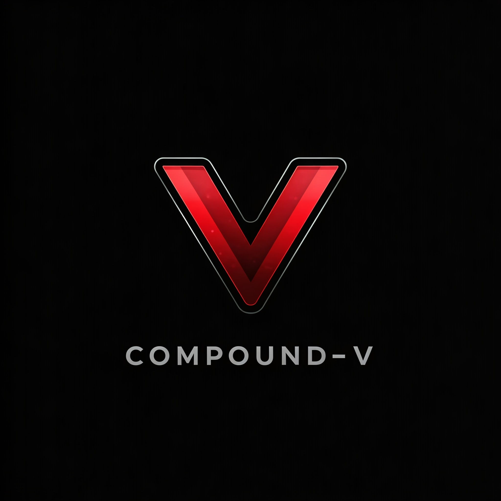

<p align="center">
    <picture>
        <source media="(prefers-color-scheme: dark)" srcset=".docs/native-asset-logo-dark-theme.png">
        
    </picture>
</p>

<p align="center">
    <a href="https://crates.io/crates/forc/0.64.0" alt="forc">
        
    </a>
    <a href="https://crates.io/crates/fuel-core/0.36.0" alt="fuel-core">
        
    </a>
</p>

## Overview

Compound-V is a [Native Asset](https://docs.fuel.network/docs/sway/blockchain-development/native_assets) on the Fuel Network.

The owner is initialized with a `constructor` and the `minting` role is OwnerOnly.

## Standards Implementations

The project implements and follows the [SRC-20; Native Asset](https://github.com/FuelLabs/sway-standards/blob/master/docs/src/src-20-native-asset.md), [SRC-5; Ownership Standard](https://github.com/FuelLabs/sway-standards/blob/master/docs/src/src-5-ownership.md) and [SRC-3; Mint and Burn](https://github.com/FuelLabs/sway-standards/blob/master/docs/src/src-3-minting-and-burning.md) standards. It also uses the [Native Asset Library](https://docs.fuel.network/docs/sway/blockchain-development/native_assets/) to implement the basic functionality behind the standards.

### SRC-20

Set functions for name, symbol, and decimals have been provided to the user. Every asset minted by this contract may contain a different name and symbol.

The [SRC-20](https://docs.fuel.network/docs/sway-standards/src-20-native-asset/) ABI defined below has also been implemented.

```sway
abi SRC20 {
    #[storage(read)]
    fn total_assets() -> u64;
    #[storage(read)]
    fn total_supply(asset: AssetId) -> Option<u64>;
    #[storage(read)]
    fn name(asset: AssetId) -> Option<String>;
    #[storage(read)]
    fn symbol(asset: AssetId) -> Option<String>;
    #[storage(read)]
    fn decimals(asset: AssetId) -> Option<u8>;
}
```

### SRC-3

The [SRC-3](https://docs.fuel.network/docs/sway-standards/src-3-minting-and-burning/) standard defines the ABI for minting and burning.

```sway
abi SRC3 {
    #[storage(read, write)]
    fn mint(recipient: Identity, sub_id: Option<SubId>, amount: u64);

    #[payable]
    #[storage(read, write)]
    fn burn(sub_id: SubId, amount: u64);
}
```

### SRC-5

The [SRC-5](https://docs.fuel.network/docs/sway-standards/src-5-ownership/) standard defines the ABI for restricting access to particular users.

```sway
abi SRC5 {
    #[storage(read)]
    fn owner() -> State;
}
```

## Project structure

The project consists of a smart contract, and unit tests with Fuel Rust-sdk/ [Fuel-rs]

<!--Only show most important files e.g. script to run, build etc.-->

```sh
comp-v
├── src
│   ├── errors.sw
│   ├── events.sw
│   ├── interface.sw
│   └── main.sw
├── tests
│   ├── functions/constructor.rs
│   ├── functions/mint.rs
│   ├── functions/mod.rs
│   ├── functions/name.rs
│   ├── functions/setup.rs
│   ├── functions/total_assets.rs
│   ├── functions/total_supply.rs
│   └── harness.rs
├── README.md
└── Forc.toml
```

## Running the project

### Project

#### Program compilation

```bash
forc build
```

#### Running the tests

Before running the tests the programs must be compiled with the command above.

```bash
cargo test -- --nocapture
```
